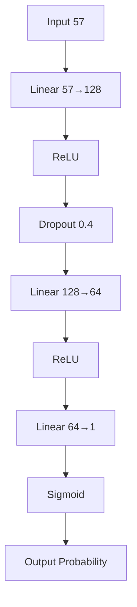

# Proyecto P2 – Clasificador de Spam

Este script implementa una red neuronal simple en **PyTorch** para clasificar correos electrónicos como *spam* o *ham* utilizando el conjunto de datos **Spambase** de la base de datos UCI.

---

## 1. Descripción General

- **Lenguaje:** Python 3
- **Frameworks:** PyTorch, scikit-learn, matplotlib
- **Fuente de datos:** UCI Machine Learning Repository (id 94 – *Spambase*)
- **Objetivo:** Entrenar una red neuronal de dos capas densas que devuelva una probabilidad (sigmoid) para cada correo.

## 2. Datos

| Fuente | Tamaño | Descripción |
|--------|--------|--------------|
| **Spambase** | 4601 ejemplos | 57 características numéricas que representan la frecuencia de palabras/feats. |

### Pre‑procesamiento

1. **Carga** usando `ucimlrepo.fetch_ucirepo`.
2. **Separación** en entrenamiento (80 %) y prueba (20 %).
3. **Escalado** con `StandardScaler` para normalizar las características.
4. Conversión a tensores de PyTorch (`float`).

## 3. Arquitectura de la Red

```text
Input (57) → Linear  → ReLU → Dropout(0.4) →
Linear → ReLU → Linear → Sigmoid → Output (prob.)
```

| Layer | Neurons | Activación |
|-------|---------|------------|
| Input | 57 | — |
| Hidden 1 | 128 | ReLU |
| Dropout | 0.4 | — |
| Hidden 2 | 64 | ReLU |
| Output | 1 | Sigmoid |

### Diagrama



## 4. Hiperparámetros

| Parámetro | Valor | Justificación |
|-----------|-------|---------------|
| `LR` | 0.001 | Valor estándar para Adam; evita oscilaciones. |
| `EPOCHS` | 500 | Convergencia suave en conjunto de 57 dim. |
| `HIDDEN_1` | 128 | Expande vectores de 57 a 128 capturando combinaciones complejas. |
| `HIDDEN_2` | 64 | Reducción progresiva (embudo). |
| `DROPOUT_RATE` | 0.4 | Evita overfitting apagando 40 % de neuronas. |

## 5. Proceso de Entrenamiento

```python
for epoch in range(EPOCHS):
    model.train()
    optimizer.zero_grad()
    outputs = model(X_train)
    loss = criterion(outputs, y_train)
    loss.backward()
    optimizer.step()
```

- Se guarda la **pérdida** y **accuracy** cada época.
- Impresión cada 50 épocas.

## 6. Evaluación Final

- Se calcula `accuracy_score` en el conjunto de prueba.
- Métricas impresas y graficadas con `matplotlib`.

## 7. Resultados

> **Accuracy Final en Test Set:** *[valor generado en ejecución]*

(El script muestra gráficas de pérdida y accuracy por época.)

## 8. Dependencias

- `torch==1.x`
- `torchvision` (si fuera necesario)
- `scikit-learn`
- `matplotlib`
- `ucimlrepo`

## 9. Uso

```bash
# Instalar dependencias
pip install torch scikit-learn matplotlib ucimlrepo

# Ejecutar
python Proyecto_P2.py
```

---

> **Nota:** El script abre una ventana de matplotlib con las curvas de pérdida y accuracy. Guardar las gráficas con `plt.savefig('resultados_entrenamiento.png')` si se desea.
